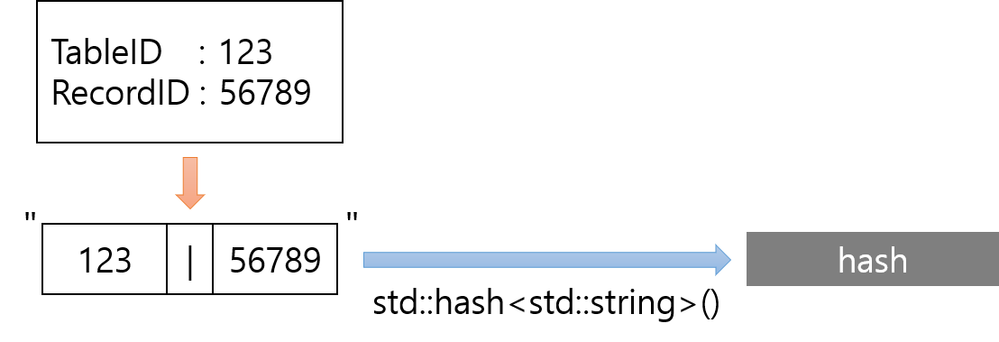
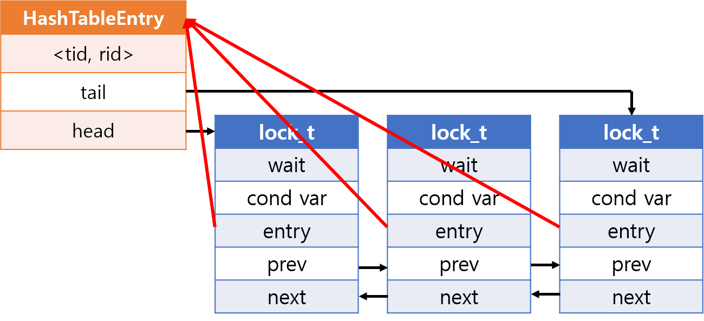
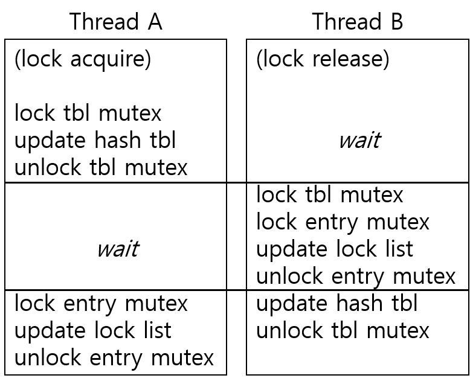

# Lock Table Implementation

## A. Hash Table
### a. hash table data structure
Hash table은 C++ 표준 라이브러리에 있는 `std::unordered_map`을 사용했다. key는 <tid, rid>로 된 tuple이며, value는 `HashTableEntry` 타입의 주솟값이다. 또한, hash table에 mutex를 두었다.

### b. hashing
C++엔 tuple의 hashing이 정의돼있지 않다. 하지만, string에 대한 hashing을 지원하므로 이를 사용했다. 따라서 "tid|rid"란 문자열을 만들고 이를 string의 hash function에 넣어 hash를 생성하도록 했다. 이에 대한 구현은 `std::hash`에 대해 template specialization로 하였다.

### c. hash table entry & lock
Hash table의 entry는 <tid, rid> tuple, entry에 대한 mutex, 그리고 lock linked list의 head, tail node를 가지고 있다.

각 lock은 대기 여부 `wait`, condition variable, next, previous node 그리고 lock이 속한 entry를 가지고 있다.

## B. Lock Policy
위 design에서 mutex는 hash table과 각 entry마다 존재한다. hash table에 있는 mutex는 hash table을 수정하는 작업을 할 때 race condition으로부터 보호하기 위해 사용되고, 각 entry에 존재하는 mutex는 lock linked list를 변경하는 작업을 보호하기 위해 사용된다.

### a. hash table lock
#### 1. lock acquire
`lock_acqure`에선 hash table에 새로운 entry를 넣을 때 hash table의 수정이 발생한다. 따라서 hash table이 수정되는 코드만 hash table mutex를 lock해 보호하면 된다.

하지만 lock linked list를 수정하는 부분까지도 hash table mutex로 보호해야한다.

그렇지 않으면 위 그림처럼 `lock_acquire`가 먼저 수행되어 lock이 있어야함에도 불구하고 **Thread B**가 실행되는 시점엔 lock이 존재하지 않다고 판단되어 entry를 파괴한 뒤 해당 entry에 **Thread A**가 접근하는 일이 발생할 수 있다.

그러나 이미 lock이 list에 존재하여 그 후에 생성된 lock이 대기하는 부분은 hash table mutex에 의해 보호받을 필요가 없으므로 해당 작업을 하기 전에 hash table mutex를 unlock한다.

#### 2. lock release
`lock_release`에선 entry의 lock linked list가 비었을 때 hash table에서 해당 entry를 제거하면서 hash table의 수정이 발생한다. 허나 lock acquire에서 본 사례와 마찬가지로 lock list를 수정하는 부분까지도 hash table mutex를 통해 보호해야한다. 그러므로 `lock_release`가 호출된 시점에 hash table mutex를 lock하고 호출이 끝나는 시점에 unlock한다.

### b. entry lock
#### 1. lock acquire/release
lock acquire와 lock release 모두 entry의 lock linked list를 변경한다. 따라서 두 method모두 호출될 때 entry mutex를 lock하고 호출이 끝날 때 unlock한다.

#### 2. using condition variable
각각 `lock_t` object가 `std::condition_varaible`을 가지고 있는 디자인과, entry에서 하나의 `std::condition_varaible`을 갖고 각 `lock_t` object는 대기 여부만 저장하게 하는 디자인을 비교했다. 전자는 `lock_t`당 80 byte, 후자는 32 byte를 차지한다. 하지만 성능을 비교했을 때 전자가 다소 빨랐다.

  
> 1 thread: 1.5% 성능 향상  
> 4 thread: 5.5% 성능 향상  
> 8 thread: 9% 성능 향상  
> 16 thread: 25.4% 성능 향상