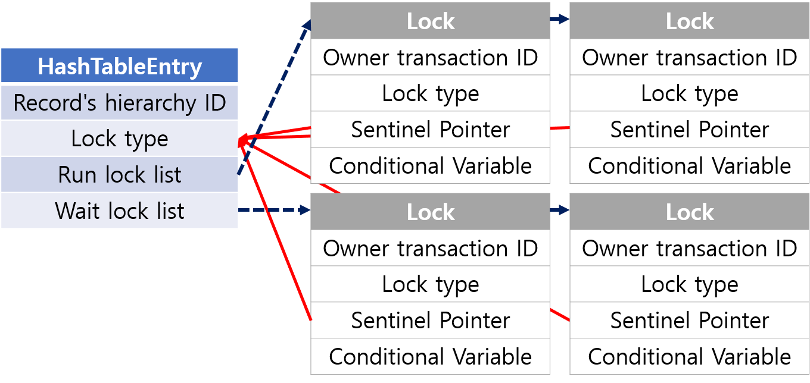
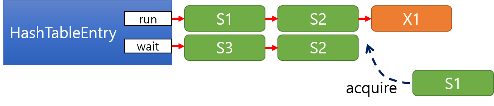

# Transaction Concurrency Control Implementation

## A. Lock
Lock의 관리는 `LockManager` 클래스에서 담당한다. Lock엔 **SHARED** mode와 **EXCLUSIVE** mode가 존재하며, **SHARED** mode는 다른 transaction과 lock을 동시에 가질 수 있으며, **EXCLUSIVE** mode가 들어오는 순간 해당하는 record는 **EXCLUSIVE** lock을 획득한 record만이 *독점적*으로 사용하게 된다.

### a. Lock structure
Lock 관련 데이터는 다음과 같은 구조로 구성된다.
  

`HashTableEntry`의 Lock type은 해당 record에 걸린 lock 중 가장 강력한 lock type을 나타낸다. 예컨대 **SHARED**와 **EXCLUSIVE** lock이 동시에 걸려있다면 `LockType::EXCLUSIVE`가 된다. 
(아무런 lock이 걸려있지 않다면 `LockType::NONE`이다)

또한 현재 record에 대해 lock을 획득한 lock의 list와 획득하지 못해 대기 중인 lock의 list를 별도로 관리한다. 그렇게 디자인한 사유는 구현의 편의와 효율성을 위해서다. lock acquire에서 acquire 혹은 wait 여부를 결정할 때 하나의 list로 관리하면 현재 동작하고 있는 lock을 찾기 위해 O(n)으로 list를 순회해야 하지만, 따로 관리할 경우 run list의 마지막과만 비교하면 되기에 효율적으로 구현하고 수행할 수 있다.

### b. lock acquire

#### 1. lock 획득 조건
Lock을 획득할 수 있는 경우는 다음과 같다.

##### (1) 현재 실행되고 있는 lock이 존재하지 않을 때
이 경우는 해당 record를 사용하고 있는 transaction이 없다는 의미이므로 lock을 바로 획득할 수 있다.

##### (2) 대기 중인 lock이 없으며 entry의 lock type이 **SHARED**이고 lock의 type도 **SHARED**일 때
이 경우엔 해당 record를 변경한 transaction이 존재하지 않은 경우이며, 또한 해당 lock을 통해서 하는 작업도 해당 record를 수정하지 않기에 dirty read, inconsistent read 등이 발생하지 않는다. 따라서 이 경우에도 lock을 바로 획득할 수 있다.

##### (3) 대기 중인 lock이 없으며 실행 중인 마지막 lock과 현재 요청하는 lock이 같은 transaction에 속할 때
같은 transaction에서 수행되는 작업은 lock으로 보호될 필요가 없다. 따라서 이 경우에도 lock을 바로 획득할 수 있다.

##### (4) lock type이 **SHARED**이며 대기 중인 lock이 존재하지만 전부 **SHARED**인 경우


위 그림과 같은 상황이다. 이때 S1은 wait에서 대기 중인 S3와 S2와 conflict가 나지 않는다. 따라서 S1은 제일 앞으로 순서를 바꾸어 생각해도 무방하며, 그 결과 실질적으로 위 3번과 같은 상황이 된다면 lock을 바로 획득할 수 있다.

#### 2. lock 획득 실패 시
lock을 획득할 수 없다면 deadlock인지 확인하고 deadlock이 아니라면 wait list에 해당 lock을 넣고 대기한다.

### c. lock release
우선을 release 할 lock을 lock list에서 지운다. 그 후 남은 lock을 다음 절차에 따라 관리한다.

#### 1. run lock list가 비어있지 않은 경우
wait에 있는 lock은 현재 run에 속한 lock과 충돌 나는 것들이다. 따라서 깨울 수 있는 wait에 속한 lock은 존재하지 않아 추가 작업 없이 바로 종료한다.

#### 2. wait lock list가 비어있는 경우
run과 wait 모두 비어있는 경우엔 더는 해당 record에 대한 lock이 없다는 의미이므로 lock hash table에서 해당 entry를 지우고 종료한다.

#### 3. wait lock list의 가장 선행하는 lock이 **EXCLUSIVE**일 경우
entry의 lock type을 `LockType::EXCLUSIVE`로 두고, 해당 lock만 깨우고 종료한다.

*다른 lock도 깨워야하는지에 관한 고찰*  
제일 처음에 있는 lock이 **EXCLUSIVE**일 때 그 이후에 있는 lock은 conflict 관계에 있다. (만약 conflict가 안난다면 `lock_acquire`에서 이미 실행했을 것이다.) 따라서 이 경우엔 오직 제일 앞의 lock만 깨우면 된다.

#### 4. wait lock list의 가장 선행하는 lock이 **SHARED**일 경우
entry의 lock type을 `LockType::SHARED`로 두고, 이후에 다시 **EXCLUSIVE** lock이 있기 직전까지의 모든 lock을 깨운다.

## B. Deadlock Detection
Deadlock의 감지 및 처리 주체는 `LockManager` 클래스이다.

### a. deadlock detection process
deadlock 감지는 다음 순서에 따라 시행된다.

#### 1. build Wait-for-Graph
lock manager에 등록된 모든 lock에 대하여 wait-for-graph를 만든다. 각 node는 선행되어 실행된 node의 xact ID의 set인 `In`과 이후에 선행된 lock을 기다리는 node의 xact ID의 set인 `Out`. 그리고 DFS를 위한 변수 `exploring`과 `visited`로 이루어진다.

#### 2. check cycle
deadlock check이 실행되는 시점은 어떤 lock이 wait 되기 직전이므로 해당 lock에 관련된 node만 탐색해주면 된다. 따라서 해당 lock의 transaction에 대응되는 node를 시작점으로 하여 DFS를 통해 cycle을 탐색한다.

#### 3. abort
위 process 진행 결과 cycle이 존재한다 판별되면 요청 들어온 lock에 대응하는 transaction을 abort 및 rollback 한다.


## C. Logging System
Log의 관리는 `LogManager` 클래스에서 담당한다.

### a. log structure
모든 log 클래스는 `Log` 클래스를 상속받는다. `Log` 클래스는 Transaction ID, Log Sequence Number (LSN), PrevLSN을 갖는다. 코드 중복을 효과적으로 줄이기 위해 `LogWithoutRecordBase`란 class template를 만들었고, record 관련 정보를 추가한 `LogWithRecordBase`란 class template를 만들었다. 그 후 각 log type에 따라 다음과 같이 Log 클래스를 만들었다.

```c++
using LogCommit = LogWithoutRecordBase<LogType::COMMIT>;
using LogAbort  = LogWithoutRecordBase<LogType::ABORT>;
using LogUpdate = LogWithRecordBase<LogType::UPDATE>;
```

### b. log manager
`LogManager` 클래스는 log를 LSN 순으로 저장하는 field와 각 transaction에 속하는 log를 효과적으로 찾을 수 있는 searching structure를 가진다.

## D. Abort and Rollback
Abort의 처리는 `XactManager` 클래스에서 담당한다.

### a. abort
abort는 `XactManager::abort` method에서 처리한다. abort가 발생하면 다음 순서대로 abort 작업을 수행한다.

#### 1. undo
해당 xact의 `undo` method를 호출한다.

#### 2. release locks
해당 transaction이 잡았던 모든 lock을 unlock 한다.

#### 3. logging
`LogAbort` log를 `LogManager`에 추가하고, `LogManager::remove` method를 호출해 searching structure에서 해당 transaction에 관련한 데이터를 지운다. (이때, 전체 log에선 지워지지 않는다.)

### b. rollback
rollback은 `Xact::undo` method에서 수행된다. `LogManager`로부터 해당 transaction에 대한 모든 유효한 log를 받아 `LogUpdate`인 log에 한해 역순으로 복구한다.

*thread safty에 관한 논의*  
rollback이 발생하는 시점엔 rollback으로 복구해야 하는 모든 record에 lock이 걸려있으며, 그 이후 다른 transaction이 해당 record에 대한 lock을 획득한 경우는 **존재하지 않는다**. 따라서 별다른 lock을 걸지 않아도 rollback은 thread-safe 하다.
